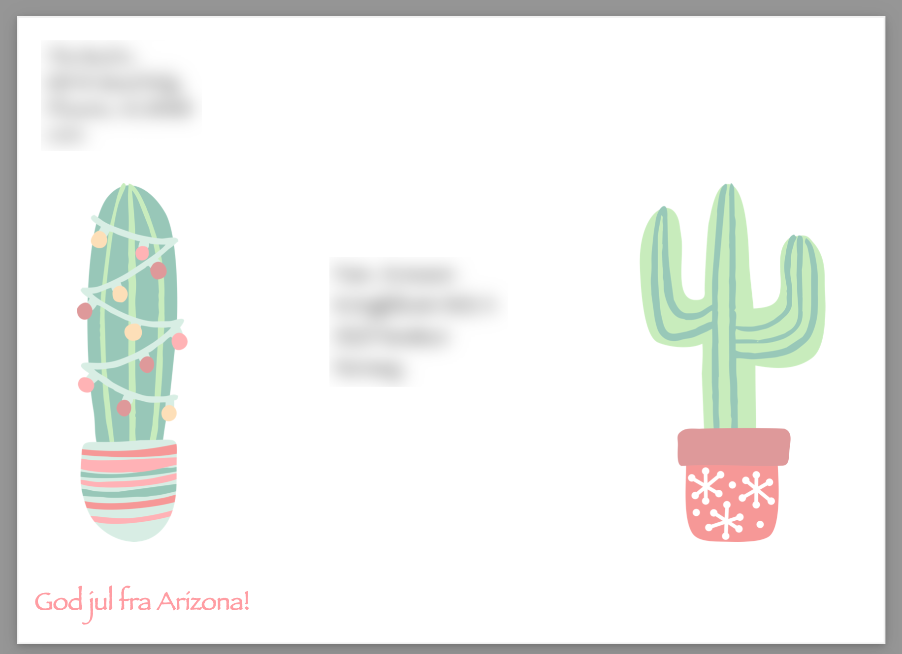

## vcard-envelope

Create envelopes from vCards, with optional editing of addresses and custom envelope layout.

### Motivation

Be able to print custom envelopes for Christmas greetings, that would allow

1. Simple editing of addresses before printing (without changing the underlying vCard) e.g. instead of naming one adult we might want to say the "The XYZ family". vCards can be exported from Apples Contacts app.
2. Add some graphics etc to the envelope in addition to addresses.

### How to run

1. Install dependencies `yarn install/npm install`.
2. Export the vCards from for your contacts.
2. Extract addresses from vCards with `node index.js import-cards your_vCards.vcf addresses.json`
3. Edit addresses.json file (if wanted). For example change singular persons to "The XYZ Family" or similar.
4. Create PDFs of the envelopes with `node index.js create-prints addresses.json envelopes.pdf`
5. You'll likely want to edit the `template.sample.html` used or duplicate it and use the `--template <template-name>` option when running `create-prints`. Then re-run the previous step until satisfied. You can also open the `template.*.html` file directly in Chrome while working on it.
6. Once satisfied print the PDFs onto envelopes.

### Sample 

